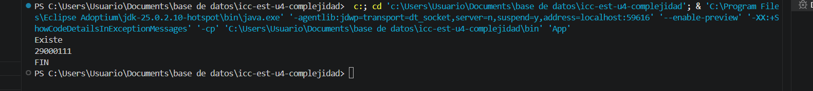

# Práctica: 04.01 Complejidad Proyecto JAVA

## Datos del Estudiante
- **Nombre:** Fernando Caguana
- **Curso:** Estructura de datos G2
- **Fecha:** 14/04/2026

---

## 1. icc-est-u4-complejidad

**Fecha:** 14/03/2026

**Descripción:** Creamos el proyecto y subimos a GitHub

---

## 2. icc-est-u4-complejidad

**Fecha:** 15/03/2026

**Descripción:** Creamos la clase Generador y Estudiante 
y creamos un listado de estudiantes con datos aleatorios para
 buscar y optimizar la busqueda.

---

